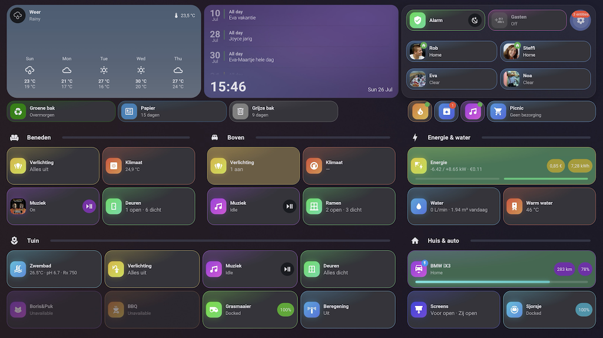

# Rob's Home Assistant Configuration

```text
 _   _                           _            _     _              _   
| | | | ___  _ __ ___   ___     / \   ___ ___(_)___| |_ __ _ _ __ | |_ 
| |_| |/ _ \| '_ ` _ \ / _ \   / _ \ / __/ __| / __| __/ _` | '_ \| __|
|  _  | (_) | | | | | |  __/  / ___ \\__ \__ \ \__ \ || (_| | | | | |_ 
|_| |_|\___/|_| |_| |_|\___| /_/   \_\___/___/_|___/\__\__,_|_| |_|\__|
```
[](https://github.com/robsonke/hass-config/actions/workflows/main.yml)

Welcome to my repository representing all Home Assistant configuration. I'm sharing this to help others, since many such other repositories helped me a lot.
Keeping this up to date is a continuous process, I discover daily new possibilities and face situations that ask for automation.

The house is in the Netherlands and covers lighting, heating (Daikin Altherma), a pool, solar (SolarEdge), EV charging (Easee + BMW iX3), an alarm (Alarmo), presence tracking, cameras (Frigate) and multi-room audio (Sonos + Music Assistant). Interface language is mostly Dutch.

# Screenshots

The dashboard is fully YAML-based and built with [Bubble Card](https://github.com/Clooos/Bubble-Card): one overview view of sections, with every device and area behind a native Bubble pop-up (`dashboards/popups/`). Theme is Material You.



# Repository layout

| Path | What's in it |
| --- | --- |
| `configuration.yaml` | Deliberately minimal — it loads packages and enables core integrations |
| `packages/` | Where the real work lives. One feature-based package per domain (`pkg_lights.yaml`, `pkg_alarm.yaml`, `pkg_pool.yaml`, `pkg_energy.yaml`, …) holding that domain's entities, helpers and template sensors |
| `automations.yaml` | All automations, many driven by blueprints |
| `scripts.yaml` | Reusable scripts (Sonos TTS, light sequences, opening the front door, …) |
| `blueprints/` | My own blueprints plus community ones |
| `dashboards/` | `bubble-dashboard.yaml` (main), a Shelly Wall Display dashboard, and `popups/` with one Bubble pop-up per device or area |
| `templates/` | Shared `custom:button-card` and decluttering-card templates |
| `esphome/` | Shelly power monitors, water meter, voice satellites and pool equipment; shared settings in `.common.yaml` |
| `appdaemon/` | ControllerX for Zigbee remotes and controllers |
| `themes/` | Custom Frosted Glass theme (dark/light) plus community themes |
| `custom_components/` | HACS and custom integrations |

# Validation

Every push and pull request is validated by GitHub Actions:

1. **YAML linting** via GitHub Super Linter across the repository
2. **Home Assistant config check** against the stable release

Real secrets live in `secrets.yaml`, which is git-ignored. CI substitutes `.stub/fakesecrets.yaml` so the config check can resolve every `!secret` reference — if you add a new secret, add a fake counterpart there too or the build fails.
